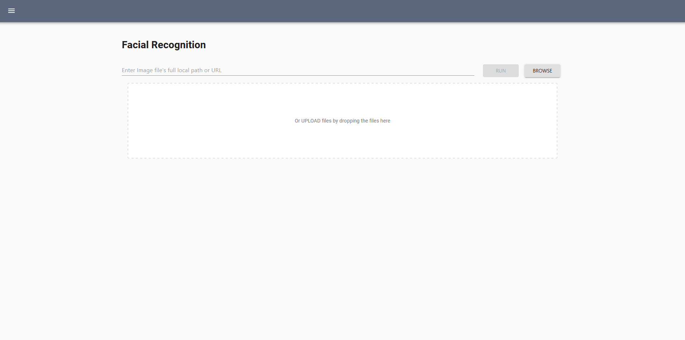
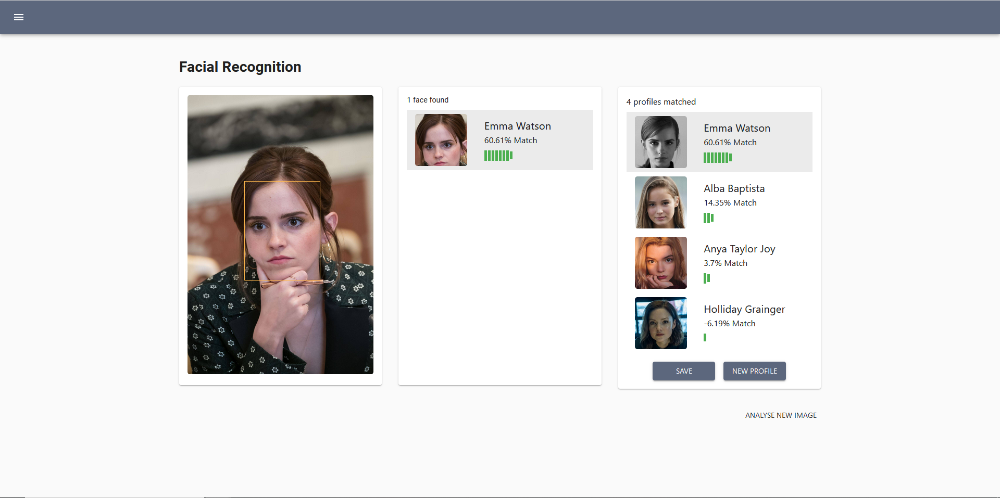
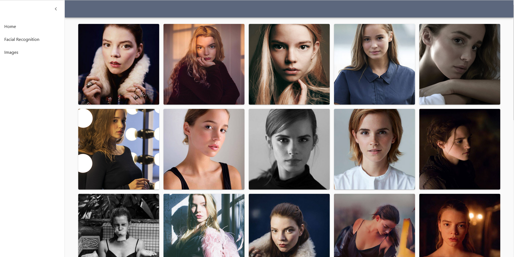
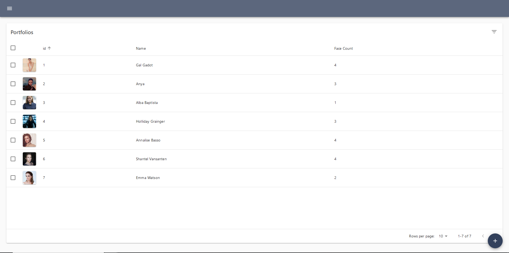
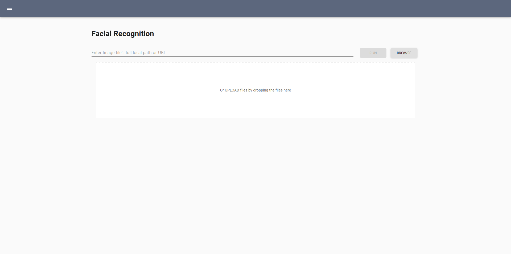

# Facial Recognition Database Management System

Note: This project is current being developed.

## Introduction

Facial Recognition Database Management System (FRDMS) is a facial recognition system made for everyone.

Powered by python and react, and packaged into a single executable that can be used by anyone with zero dependencies required.

## Usage

Download the latest release from the [right side bar](https://github.com/ivan0313/Facial-Recognition-Database-Management-System/releases).

Please note that the current release works on windows only,
download [Visual C++ Redistributable for Visual Studio 2019](https://support.microsoft.com/en-us/topic/the-latest-supported-visual-c-downloads-2647da03-1eea-4433-9aff-95f26a218cc0) for FRDMS to work properly.

Download FRDMS.db and place it in the same directory as FRDMS.exe to use a sample starter database. Or start FRDMS.exe directly to create a blank database.

## Pages

### Facial Recognition

### Images

### Profiles

### Upload Image

## Features

### Facial Recognition (In-progress)

Find a face match by supplying an input image, and the system will search the database to locate possible matches

1. face identification (Done)

    Classifies a face to a specific identity selected from existing profile in the database

2. face verification (In-progress)

    Determine whether a pair of faces belongs to the same identity
    so un-identified faces can be grouped together

3. Batch processing (In-progress)

    To perform the 2 task above in batch.

### Web Crawling (To-do)

Launch web crawling workers to craw through social platforms for images and profiles

### Personnel Classification (To-do)

Face profiles can be classified into multiple groups using supervised or unsupervised machine learning models

### Automatic Profile Creation (To-do)

Supply large amount of unlabelled images into the system to be classified by person.
New unnamed profile can be created automatically when input photo fail to match any existing profiles
Data crawled from social medias will be used to populate newly created profile as much as possible.

### Live Video Recognition (To-do)

Identify known faces in the database from a live video

## Contributing

For guidance on setting up a development environment and how to make a contribution to Flask, see the [contributing guidelines](./CONTRIBUTING.md).
